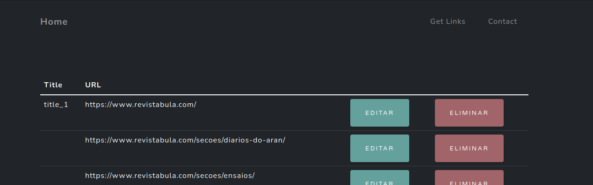

# manage-links-front
Front-end system to manage links 

## Aplicação simples, bem intituiva para gerenciar seus links.

### Ao clicar no botão `Get Links` vai abrir uma `input` para adicionar o link de uma pagina web e pegar os links contidos nessa pagina, ou seja, simples `web crawler` :)

### Mas ainda foi testado apenas nessa pagina :)
`https://www.revistabula.com/7073-lista-definitiva-dos-100-melhores-filmes-da-historia-do-cinema/`

### Servidor de apis `https://github.com/c-mike/manage-links-back`
